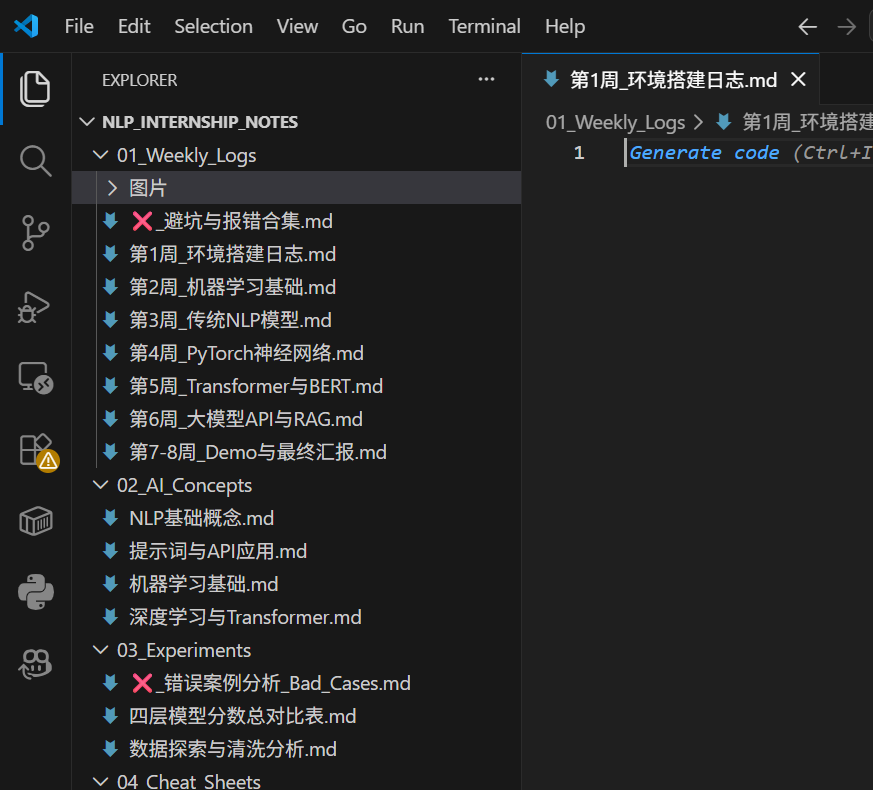
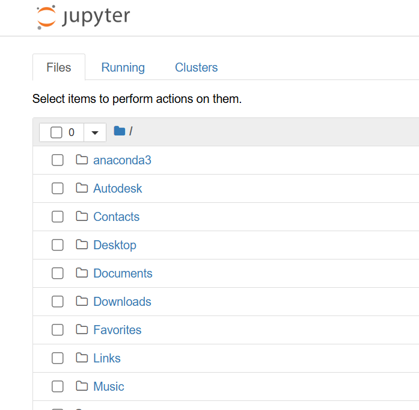
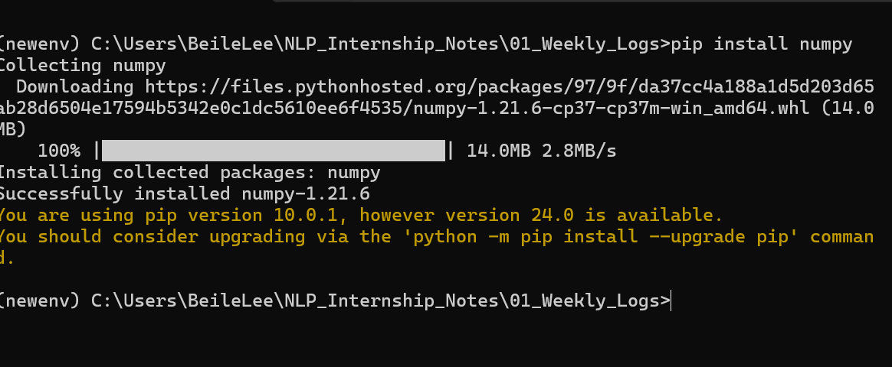

## vscode使用&python环境搭建
#### 使用 “New-Item -ItemType Directory -Path”进行文件夹创建，并使用“code ./”进行打开
> 

* **常用快捷键记录：**
  * `Ctrl + ~` 打开/关闭内置终端。
  * `Ctrl + Shift + P` 唤出全局命令面板。
* **PowerShell 避坑：** * 遇到“禁止运行脚本”报错时，用管理员运行：`Set-ExecutionPolicy RemoteSigned -Scope CurrentUser`

## jupyter notebook下载与使用
#### 使用 “pip install jupyter” 或 “conda install jupyter” 进行安装
#### 在终端输入 “jupyter notebook” 启动服务
> 

* **VS Code 插件用法（更推荐）：** * 直接在扩展商店装 `Jupyter` 插件，新建 `.ipynb` 文件，右上角选好 Kernel 就能直接跑代码。
* **常用快捷键：**
  * `Shift + Enter` 运行当前代码块。
  * `A` 在上方插入新块，`B` 在下方插入新块。

## python的环境配置和安装包的下载
#### 使用 “conda create -n env_name python=3.10” 创建独立虚拟环境
#### 使用 “pip install 🚀” 一键下载项目所需的包
> 

* **本次实习核心安装包：**
  * 数据处理：`numpy`, `pandas`, `matplotlib`
  * 机器学习与 NLP：`scikit-learn`, `torch`, `transformers`
* **换源加速（防止下载卡死）：**
  * `pip config set global.index-url https://pypi.tuna.tsinghua.edu.cn/simple`
## 虚拟环境配置
### 虚拟环境的定义
> 虚拟环境是一种在单一物理操作系统上，通过软件机制创建的、与全局系统及其他环境相互隔离的局部执行环境。它拥有自己独立的运行运行时二进制文件（如 Python 解释器）、标准库以及第三方依赖包目录。
### Conda 虚拟环境配置与项目管理教程

#### 一、 标准管理法（推荐：环境与代码分离）

#### 1. 进入项目目录

```cmd
cd C:\path\to\your\project

```

#### 2. 创建并命名虚拟环境

```cmd
conda create --n my_project_env python=3.10 -y
//创建快捷环境
//新环境的名字：my_project_env
//指定基础依赖与版本：python=3.10
//自动确认：-y
```

#### 3. 激活虚拟环境

```cmd
conda activate my_project_env
//激活语句：activate
```

#### 4. 退出虚拟环境

```cmd
conda deactivate
推出语句：deactivate
```

---

### 二、 本地化管理法（将环境文件夹建在项目内部）

#### 1. 进入项目目录

```cmd
cd C:\path\to\your\project
```

#### 2. 在当前目录下创建环境（指定路径为 `./env`）

```cmd
conda create --p ./env python=3.10 -y
//创建特定文件的环境，只能应用于这个文件里面
//环境文件储存到当前文件夹下的env文件中
```

#### 3. 激活项目内的虚拟环境

```cmd
conda activate ./env
```

#### 4. 退出虚拟环境

```cmd
conda deactivate
```

---

### 三、 环境导出与团队协同

#### 1. 导出当前环境的依赖清单

在激活的环境下执行：

```cmd
conda env export > environment.yml
//到处里面的依赖
```

#### 2. 在新电脑上根据清单一键重建环境

将 `environment.yml` 放入项目根目录，在当前目录下执行：

```cmd
conda env create -f environment.yml
```

---

### 四、 常用维护指令

* **查看所有已创建的环境**：`conda env list`
* **删除指定的虚拟环境**：`conda remove --n my_project_env --all -y`
* **删除项目内部的环境**：`conda remove --p ./env --all -y`